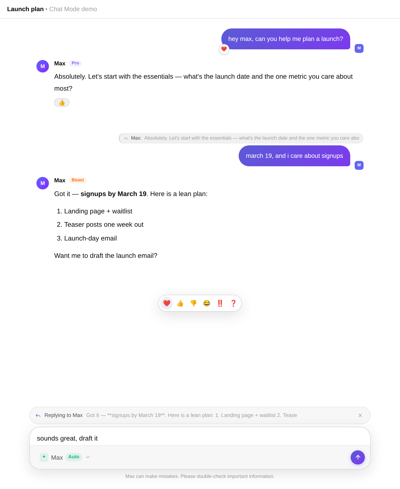
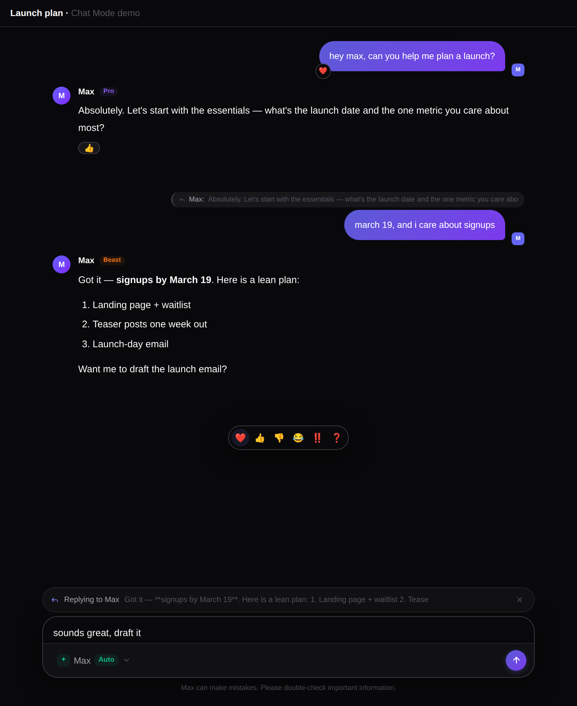

# Chat Mode: Tapbacks & Replies (plus migrations, personalities, and an English polish)

This document explains a change that turns maxAI's *Chat Mode* from a one-trick
feature (buffering messages while Max is thinking) into something that feels
like a real messaging app: you can react to a message with a tapback, and you
can reply to a specific message — in both directions, human ↔ AI. Along the way
it also fixes two quieter problems: the database had no migrations, and the
"personality" you picked was never actually being sent to the model.

## Background

If you have never touched this codebase, here is the lay of the land.

maxAI is split into a **backend** (Node + Express + TypeScript, talking to
Postgres through Prisma, and to Azure OpenAI for the actual model) and a
**frontend** (React + Vite + Zustand for state). A conversation is a list of
messages; each message has a `role` (`user`, `assistant`, or `system`) and some
text. When you send a message, the backend saves it, replays the conversation
history to the model, and streams the answer back token-by-token over
**Server-Sent Events (SSE)** — a simple one-way stream of `data: {...}` lines.

> [!NOTE]
> **SSE in one sentence:** the server keeps the HTTP response open and writes
> `data: <json>\n\n` chunks as they happen; the browser reads them off a stream
> reader and updates the UI live. That is how you see Max "typing".

Two features already existed before this change:

- **Personalities** (`Casual`, `Assistant`, `Professional`) — a per-user choice
  that is supposed to set Max's tone via a system prompt.
- **Chat Mode** — a per-user toggle. When on, you can keep sending messages
  while Max is still answering; those messages are queued and delivered together
  so Max replies to all of them at once.

Now the parts that were *not* in good shape, and which this change addresses:

1. **No Prisma migrations.** The repository had a `schema.prisma` but no
   `migrations/` folder. The container start-up script ran `prisma db push`,
   which force-syncs the database to match the schema. That works on a laptop,
   but it is not a migration history: there is no record of *how* the schema
   evolved, no reviewable SQL, and `db push` can silently drop columns/data when
   the schema and database disagree.
2. **Personalities were defined but never applied.** The chat route passed only
   the user's optional custom `systemPrompt` to the model. The carefully written
   personality prompts in `personalities.ts` were dead code at request time.
3. **Mixed German/English UI and errors.**

## Intuition

The heart of the new feature is a small question: *when the AI wants to react to
your message with a ❤️, how does it say so, and how do we keep that "❤️" out of
the visible text?*

The answer is a tiny **control protocol**. When Chat Mode is on, we tell Max it
may begin a response with an optional control block — each directive on its own
line — followed by a blank line and then the real message:

```
<<react:love>>
<<reply>>

here's the launch email draft...
```

The backend reads those first lines, records "reaction = love, isReply = true",
strips them from the stream, and only the visible text ("here's the launch
email draft…") ever reaches your screen. A response can even be *just* a
tapback with no text — a bare `<<react:love>>` — exactly like double-tapping a
message in iMessage.

The subtle part is that the text arrives in **arbitrary chunks**. The token
`<<react:love>>` might arrive as `<<re`, then `act:lo`, then `ve>>\n`. So the
parser cannot look at one chunk in isolation; it buffers until it can prove a
line either *is* a complete directive or *cannot* be one, and only then decides
whether to hide it or show it.

For the **other direction** — you reacting to Max, or replying to an earlier
message — there is no protocol to parse. We just store a `reaction` string and a
`replyToId` on the message, and when we replay history to the model we translate
those into plain-language system notes:

```
(assistant) "the deploy finished at 3pm"
(system)    "[Tapback] The user reacted with ❤️ (love) to your message above."
```

That sentence is exactly the information the request asked for: *"when you send
a tapback, the model gets the info that the user reacted to the following
message with…"*. Replies work the same way — the quoted message is folded into
the text the model sees: `[Reply to Max: "the deploy finished…"] thanks!`.

## Code

### Data model & migrations

`Message` gains two fields — a tapback and a self-referential reply link:

```prisma
model Message {
  // ...
  reaction   String?   // tapback reaction (e.g. "love") — Chat Mode only
  replyToId  String?
  replyTo    Message?  @relation("MessageReplies", fields: [replyToId], references: [id], onDelete: SetNull)
  replies    Message[] @relation("MessageReplies")
}
```

The missing migration history is now real. `prisma/migrations/` contains three
ordered steps — the initial schema, the earlier `personality`/`chatMode`
columns, and the new reaction/reply columns:

```sql
-- 20260101000002_add_message_reactions_and_replies
ALTER TABLE "Message" ADD COLUMN "reaction" TEXT;
ALTER TABLE "Message" ADD COLUMN "replyToId" TEXT;
ALTER TABLE "Message" ADD CONSTRAINT "Message_replyToId_fkey"
  FOREIGN KEY ("replyToId") REFERENCES "Message"("id") ON DELETE SET NULL ON UPDATE CASCADE;
```

`entrypoint.sh` now runs `prisma migrate deploy` (apply pending migrations,
non-destructive) instead of `db push`, the Dockerfile ships the `migrations/`
folder, and the confusing duplicate schema at `src/prisma/schema.prisma` is
gone — there is now a single source of truth.

> [!IMPORTANT]
> `migrate deploy` only ever *applies* committed migrations. It never
> improvises changes by diffing the schema, so it cannot silently drop a column
> the way `db push` can.

### The control-block parser

`services/chatMode.ts` holds `AssistantStreamFilter`, a small state machine fed
one streamed chunk at a time. It keeps a buffer and, line by line, either
consumes a directive or declares the header finished and flushes the rest as
visible content. The key guard is "could this partial line still become a
directive?" — if not, we stop buffering immediately so normal text is never
delayed:

```ts
const visible = chatMode ? filter.push(chunk) : chunk;
if (visible) {
  visibleContent += visible;
  res.write(`data: ${JSON.stringify({ type: 'delta', content: visible })}\n\n`);
}
// ...after the stream ends:
const control = filter.getControl(); // { reaction, isReply }
```

### Folding tapbacks and replies into history

`buildModelHistory()` walks the stored messages and, for each one, appends a
plain-language system note when a reaction is present and a quoted prefix when
it is a reply. This is the whole mechanism by which the model "knows" about
reactions and reply threads — no special model features required.

### The chat route

`routes/chat.ts` now composes the system prompt properly and gates every new
capability behind Chat Mode:

```ts
let systemPrompt = buildSystemPrompt(user?.personality, user?.systemPrompt);
if (chatMode) systemPrompt = `${systemPrompt}\n\n${chatModeInstructions()}`;
```

That one line is the fix for the dead personality feature: `buildSystemPrompt`
layers the user's custom instruction on top of the chosen personality's base
prompt. There is also a new, ownership-checked endpoint for user-authored
tapbacks, which refuses to do anything when Chat Mode is off:

```ts
router.put('/conversations/:id/messages/:messageId/reaction', /* ... */);
// 403 if !user.chatMode; 404 if the message isn't in a conversation you own
```

### Frontend

- `lib/reactions.ts` mirrors the backend's six reactions (❤️ 👍 👎 😂 ‼️ ❓).
- `components/chat/Tapback.tsx` provides the picker popover, the iMessage-style
  corner **badge** for user bubbles, and an **inline chip** for assistant
  messages (which have no bubble).
- `MessageBubble.tsx` shows a message's reaction, a quoted **reply preview**, and
  hover actions (reply / react) that appear only in Chat Mode.
- `ChatInput.tsx` shows a **reply banner** with Esc-to-cancel.
- `useChat.ts` sends `replyToId`, applies AI-authored reactions from the new
  `reaction` SSE event, and correctly handles a bare-tapback response (a `done`
  event whose `message` is `null`).
- `ChatPage.tsx` owns the reply target and does an **optimistic** reaction update
  that reverts if the request fails.

## Verification

- **Backend build:** `npm run build` (tsc) — clean.
- **Frontend build:** `npm run build` (tsc + vite) — clean.
- **Lint:** `oxlint` — 0 errors; warnings reduced from 16 to 5 (the remaining 5
  are pre-existing `react-hooks/exhaustive-deps` notes).
- **Unit tests:** `npm test` in `backend/` — **298 assertions pass**.
  - The stream parser is tested by replaying representative inputs at *every*
    chunk size from 1 up to the full length, so chunk-boundary splits like
    `<<re | act:lo | ve>>` are all covered.
  - `buildModelHistory` is tested for plain history, user→AI reactions, AI→user
    reactions, reply folding, invalid reaction names, and orphaned reply ids.
- **Visual test:** rendered the real components with mock data in headless
  Chromium (Playwright) and captured light and dark themes.

> [!NOTE]
> Prisma's engine download is blocked in the CI sandbox (HTTP 403), so
> `prisma generate`/`migrate` run in the Docker build, not here. The migration
> SQL follows Prisma's own generated format and the schema change is additive.

**How to verify manually:**

1. `docker compose up -d --build`, register, and finish onboarding.
2. In **Settings → AI & Models**, turn **Chat Mode** on.
3. Hover a message → use the **reply** and **tapback** buttons; confirm the
   badge/chip appears and survives a page reload (it is persisted).
4. Reply to one of Max's messages and confirm the quoted preview appears above
   your message and that Max's answer takes the quote into account.
5. Turn Chat Mode **off** and confirm the reply/tapback controls disappear and
   the reaction endpoint returns 403.




## Alternatives

**How the AI expresses a tapback/reply.** I chose a leading text control block
(`<<react:love>>`).

| | Pros | Cons |
|---|---|---|
| **Control block (chosen)** | Works with plain streaming; no extra model round-trip; easy to strip | Needs a careful chunk-safe parser; relies on the model following format |
| **Tool / function calling** | Structured, no parsing | Extra latency/round-trips; complicates streaming; heavier Azure setup |
| **Second classifier call** | Keeps the chat call clean | Doubles cost/latency for every message |

**Reply/reaction context for the model.** I inject plain-language system notes.

| | Pros | Cons |
|---|---|---|
| **System notes (chosen)** | Model-agnostic; human-readable; trivial to debug in logs | Adds tokens to the prompt |
| **Structured message metadata** | Compact | No standard the model reliably understands; still needs prose in practice |

## Suggested people to talk to

- **Malte Höpers (@Malti2)** authored the original Chat Mode commit
  (*"add Chat Mode (multi-message buffering with natural AI response)"*) and the
  initial implementation. He is the person to talk to about the queued-message
  design that tapbacks/replies build on, and about the intended product feel.

Since the recent history on these files is essentially just Malte and the AI
assistant, he is the single best point of contact for this area.

## Quiz

<details>
<summary>1. In Chat Mode, how does Max tell the backend it wants to react to your message with ❤️?</summary>

**Answer: B.** It emits a leading control line `<<react:love>>` before the
visible text.

- A. It calls an Azure function tool — ✗ no tool calling is used.
- **B. A leading `<<react:love>>` control line the backend parses and strips — ✓**
- C. It sets an HTTP header — ✗ the model only produces text, not headers.
- D. It stores the reaction in the database directly — ✗ the model never touches the DB; the backend applies it.
</details>

<details>
<summary>2. Why can't the stream parser decide directive-vs-text from a single chunk?</summary>

**Answer: C.** Tokens arrive in arbitrary pieces, so `<<react:love>>` may be
split across several chunks and must be buffered until it can be resolved.

- A. Because SSE encrypts each chunk — ✗ SSE is plain text.
- B. Because React batches updates — ✗ unrelated to server parsing.
- **C. Chunk boundaries can split a directive, so it must buffer — ✓**
- D. Because the model sends JSON — ✗ deltas are raw text.
</details>

<details>
<summary>3. What one-line change fixed the "personalities never applied" bug?</summary>

**Answer: A.** Building the system prompt with
`buildSystemPrompt(user.personality, user.systemPrompt)` instead of passing only
the custom `systemPrompt`.

- **A. Composing personality + custom instruction into the system prompt — ✓**
- B. Adding a new database column — ✗ the column already existed.
- C. Translating the UI to English — ✗ unrelated.
- D. Switching to `migrate deploy` — ✗ that is the migrations fix.
</details>

<details>
<summary>4. Why switch the container from `prisma db push` to `prisma migrate deploy`?</summary>

**Answer: B.** `migrate deploy` applies a committed, reviewable migration
history and never improvises schema changes, so it won't silently drop columns.

- A. It is faster — ✗ not the reason.
- **B. It applies a reviewable history and is non-destructive — ✓**
- C. It generates the Prisma client — ✗ that is `prisma generate`.
- D. It seeds test data — ✗ it does not.
</details>

<details>
<summary>5. How does the model learn that you reacted to one of its messages?</summary>

**Answer: D.** When replaying history, the backend inserts a system note like
`[Tapback] The user reacted with ❤️ (love) to your message above.` right after
that message.

- A. The reaction emoji is appended to the message text — ✗ it is a separate note.
- B. Through a fine-tuned model — ✗ no fine-tuning.
- C. It doesn't; reactions are UI-only — ✗ the whole point is that the model is told.
- **D. A plain-language system note injected after the reacted message — ✓**
</details>
