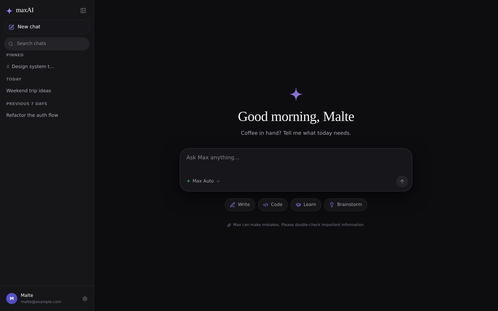
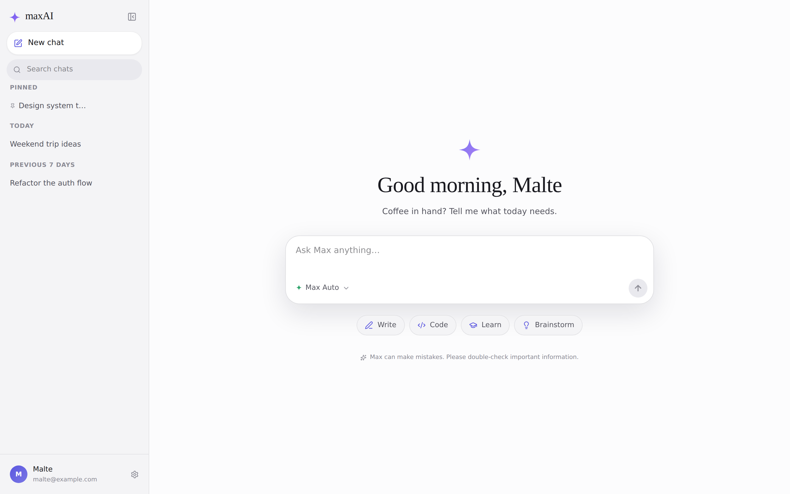
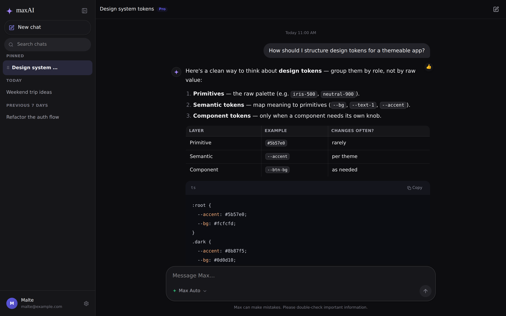
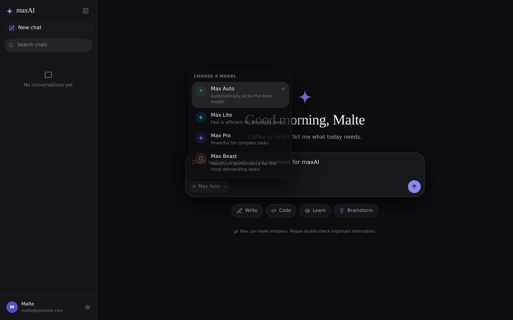
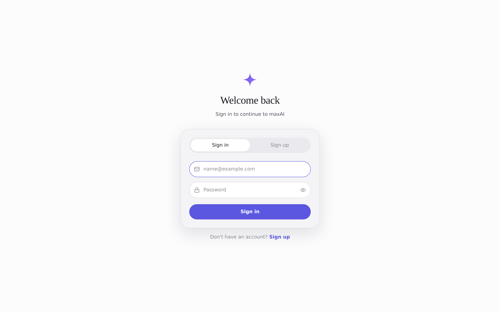
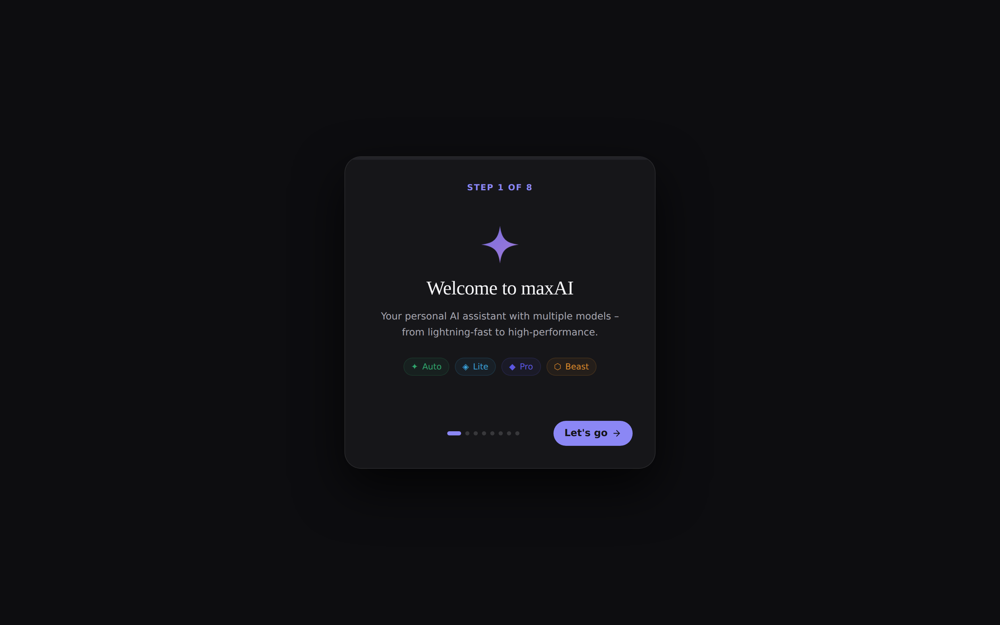
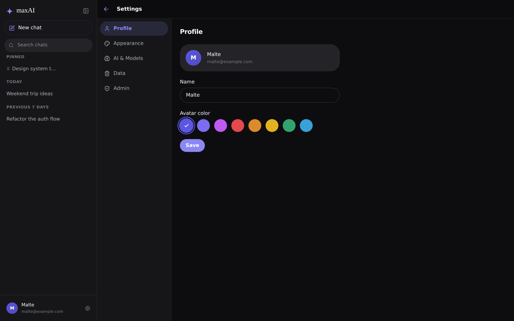
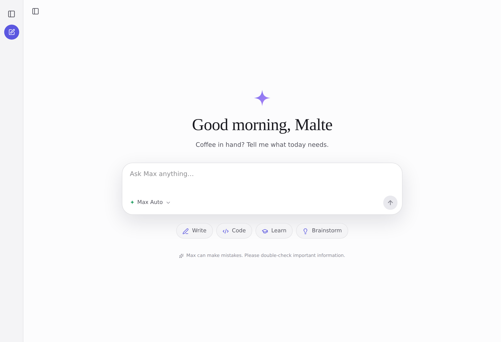

# maxAI — Design-Upgrade, Tageszeit-Startseite und Produktions-Politur

> Erklärungsdokument zur Draft-PR. Es erklärt die Änderungen von Grund auf —
> überspring Abschnitte, die du schon kennst.

## Hintergrund

**maxAI** ist eine selbstgehostete Chat-Anwendung. **Max** ist der Name der KI,
**maxAI** die Plattform. Der Stack:

- **Frontend** (`frontend/`): React 19 + TypeScript + Tailwind CSS v4, gebaut mit
  Vite. Login, Onboarding, Chat, Einstellungen, Admin-Bereich. Zustand für State,
  SSE fürs Streaming.
- **Backend** (`backend/`): Node.js + Express + TypeScript. Spricht über einen
  Chat-Completions-kompatiblen Endpunkt mit dem KI-Anbieter, speichert per Prisma
  in PostgreSQL und streamt Antworten per Server-Sent-Events.
- **Infrastruktur**: `docker-compose.yml` mit postgres + backend + web (nginx),
  ein öffentlicher Port.

Vor dieser Änderung trug die Oberfläche eine **iMessage-artige Optik**: glänzende
blaue Sprechblasen mit „Tails", „Delivered"-Quittungen und ein blau-violetter
Verlauf als Marke. Die Startseite zeigte eine statische Begrüßung
(„What can I help you with today?").

Der Auftrag: das Produkt **produktionsreif** machen, vorhandene Fehler beheben und
ein **Design-Upgrade** durchführen — minimalistisch, ruhig und eigenständig (im
Geist moderner Assistenten, aber bewusst **kein** Klon eines fremden Produkts),
und die statische Begrüßung durch **tageszeitabhängige** Nachrichten ersetzen.

## Intuition

Die Kernidee: weg von der verspielten Chat-Blasen-Optik, hin zu einer **ruhigen,
typografischen, minimalistischen** Oberfläche mit einer **eigenen Identität**.

- Eine einzige, zurückhaltende Akzentfarbe („Iris"), eine **Serifenschrift
  (Fraunces)** für Überschriften/Begrüßung, viel Weißraum, feine Trennlinien statt
  Schatten-Spielereien. Hell und Dunkel.
- Eine eigene **Spark-Marke** (eine weiche Vierpunkt-Sonne mit rundem Kern) —
  bewusst anders als der dünne Stern anderer Assistenten.
- Die Startseite empfängt mit einer **Serifen-Begrüßung nach Tageszeit**
  („Good morning, Malte", „Working late" …) plus einer kurzen, rotierenden Zeile
  in Max' Stimme, darunter eine zentrierte Eingabe und Vorschlags-Chips.
- Nachrichten lesen sich wie ein Dokument: **deine** Beiträge in ruhigen neutralen
  Karten, **Max'** Antworten als klare Prosa mit kleinem Spark-Avatar — ohne
  glänzende Blasen, Tails oder „Delivered".

**Beispiel Tageszeit:** Um 9 Uhr erscheint „Good morning, Malte" mit
„A fresh start. What are we working on first?"; um 23 Uhr „Working late" mit
„The quiet hours are good for deep work." Die Unterzeile wird pro Tag
deterministisch aus einem passenden Pool gewählt — stabil im Render, frisch über
die Tage.




## Codeänderungen

### Neues Design-System (`frontend/src/index.css`)

Das Fundament: neue semantische Tokens für Hell/Dunkel (`--bg`, `--surface`,
`--text-1..3`, `--border*`, `--accent` + `--accent-soft`, `--brand-a/-b`,
Radien, Schatten). Die glänzenden Blasen-Verläufe, Tails und die alte
`--bubble-*`/`brand-gradient`-Optik wurden entfernt. Neu: `--font-serif`
(Fraunces), `.display`-Klasse, ruhigere Prosa-/Codeblock-/Tabellen-Stile und ein
tastaturfreundlicher Fokus-Ring (`:focus-visible`).

### Startseite mit Tageszeit-Begrüßung

- **`frontend/src/lib/greeting.ts`** (neu): `getTimeOfDay()` und `getGreeting()`
  liefern Held-Zeile + rotierende Unterzeile je Tageszeit.
- **`frontend/src/components/chat/Home.tsx`** (neu): zentrierte Serifen-Begrüßung,
  Spark-Marke, zentrierte Eingabe (`ChatInput variant="home"`) und
  Vorschlags-Chips. Ersetzt die alte `EmptyState.tsx` (entfernt).
- **`frontend/src/components/ui/Spark.tsx`** (neu): die Marken-„Spark" als SVG mit
  Iris-Verlauf; auch das Favicon (`public/favicon.svg`) trägt sie.

### Nachrichten & Composer

- **`MessageBubble.tsx`**: Nutzer = ruhige neutrale Karte (`.bubble-user`), Max =
  Prosa mit Spark-Avatar; Aktionen (Kopieren, Regenerieren, Antworten, Tapback)
  plus Modell/Zeit/Token in einer aufgeräumten Meta-Zeile. Tapbacks/Replies und
  der Chat-Mode bleiben voll funktionsfähig.
- **`ChatInput.tsx`**: großzügige, abgerundete Composer-Box mit Varianten
  `home` (zentriert) und `docked` (unten). **`ModelSelector.tsx`** ist jetzt eine
  beschriftete Pille („Max Auto ⌄").
- **`ChatPage.tsx`**: rendert die Startseite bei leerem Verlauf, sonst den
  Nachrichten-Strom; schlanke Kopfzeile.




### Angeglichene Screens

`Sidebar` (Spark-Wortmarke, aufgeräumte Zeilen), `AuthPage`, `OnboardingFlow`,
`SettingsPage`, `AdminPanel`, `Tapback`, `Toaster`, `Avatar` und die Modell-/
Persönlichkeitsfarben (`models.ts`, `personalities.ts`) wurden auf die neue
Palette gebracht.






### Fehlerbehebung (Backend): korrektes History-Fenster

In `backend/src/routes/chat.ts` lud die Sende-Route den Verlauf mit
`orderBy: { createdAt: 'asc' }, take: 50` — das behält die **ältesten** 50
Nachrichten. Bei Konversationen mit **mehr als 50 Nachrichten** verlor Max damit
den **aktuellen** Kontext und antwortete auf Basis uralter Nachrichten. Fix: die
**neuesten** 50 laden (`desc`) und chronologisch umdrehen — konsistent mit den
Routen für Regenerieren/Bearbeiten, die bereits `slice(-50)` verwenden.

```ts
// vorher: nahm die ältesten 50 Nachrichten
include: { messages: { orderBy: { createdAt: 'asc' }, take: HISTORY_LIMIT } },
// nachher: neueste 50, dann chronologisch
include: { messages: { orderBy: { createdAt: 'desc' }, take: HISTORY_LIMIT } },
// ...
const storedMsgs = [...(conv.messages as StoredMessage[])].reverse();
```

### Produktions-Politur

- **Kein Theme-Flackern (FOUC):** ein winziges Inline-Skript in `index.html` setzt
  das gespeicherte Theme **vor** dem ersten Paint.
- **ErrorBoundary** (`components/ui/ErrorBoundary.tsx`): fängt Render-Fehler ab und
  zeigt eine ruhige Rückfall-Ansicht statt eines weißen Bildschirms.
- **Code-Splitting** (`vite.config.ts`): große Vendors (React, Markdown,
  highlight.js, framer-motion) landen in eigenen, cachebaren Chunks. Der
  Haupt-Chunk sank von **835 kB auf 172 kB** (gzip 263 → 52 kB).
- **Meta/Favicon:** Titel, Beschreibung, OG-Tags, `theme-color` je Schema und ein
  neues Spark-Favicon. README an das neue Design angeglichen.

## Verifizierung

Automatisierte Prüfungen (alle grün):

- **Backend-Build:** `npm run build` (tsc) — fehlerfrei.
- **Backend-Tests:** `npm test` — chatMode 279, buildModelHistory 19, units 21,
  alle bestanden.
- **Frontend-Build:** `npm run build` (tsc + vite) — erfolgreich, Vendor-Chunks
  wie erwartet.
- **Frontend-Lint:** `npm run lint` (oxlint) — 0 Warnungen, 0 Fehler.

Manuelle/visuelle Prüfung: die gebaute App wurde per `vite preview` gestartet und
mit Playwright (Chromium) in **Hell und Dunkel** überprüft — Login, Startseite mit
Tageszeit-Begrüßung, Konversation (Markdown, Codeblock, Tabelle, Tapback),
Modell-Dropdown, aktiver Sende-Zustand, eingeklappte Sidebar, Onboarding und
Einstellungen. Das Wechseln zwischen Konversationen wurde funktional getestet
(die jeweils richtigen Nachrichten werden geladen). Screenshots siehe oben.

Bekannte Einschränkung: Ein vollständiger End-to-End-Sendevorgang samt echter
KI-Antwort wurde nicht geprüft, da dafür ein konfigurierter Anbieter und eine
Datenbank nötig sind; die Streaming-Logik selbst blieb unverändert. Die
Prisma-Client-Generierung ist in dieser Sandbox netzwerkbedingt blockiert (betrifft
nur den Docker-/Laufzeit-Build, nicht den Code).

## Alternativen

| Ansatz | Abwägung |
|--------|----------|
| Blasen-Optik nur umfärben | Schnell, aber weiterhin „Chat-Spielzeug"-Anmutung — verfehlt das Ziel „minimalistisch, publizierbar". |
| Vollständige, dokumentnahe Prosa-Optik (gewählt) | Ruhiger, lesbar, eigenständig; behält alle Funktionen (Tapbacks, Replies, Chat-Mode) durch beibehaltene Anker. |
| Warmes Creme/Terrakotta wie das Referenzbild | Zu nah am Vorbild (Copyright/Anmutung). Stattdessen kühl-neutrale Fläche mit eigener Iris-Marke — klar unterscheidbar. |
| Deutsche Begrüßungstexte | Der Rest der App ist durchgängig Englisch; gemischte Sprachen wirken inkonsistent. Begrüßung daher englisch, aber tageszeitabhängig (Kern der Anforderung). |
