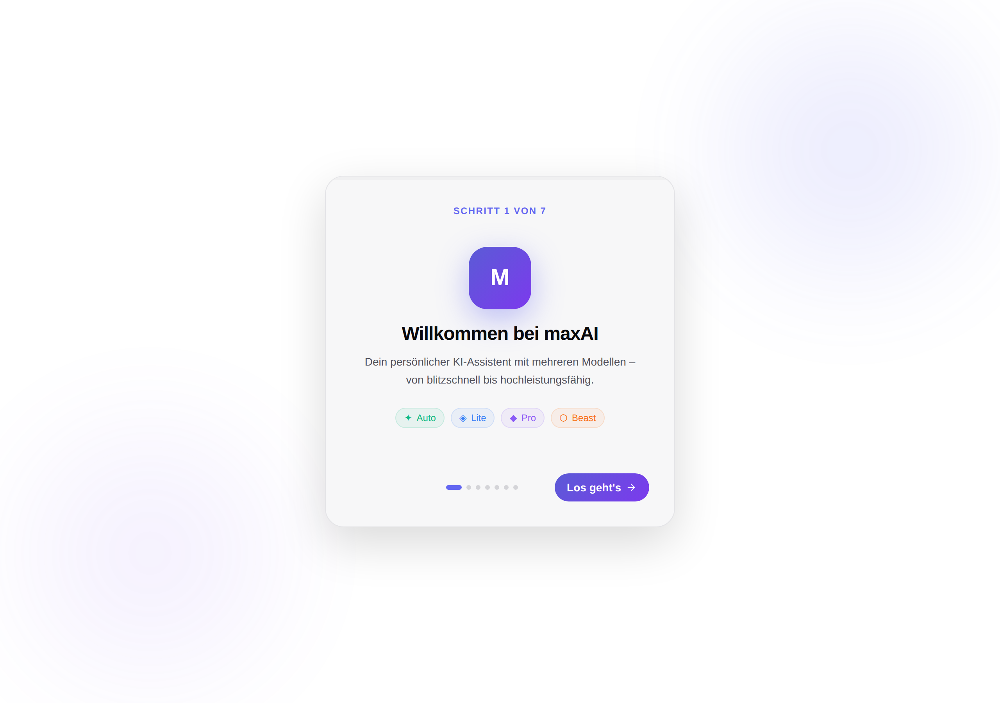
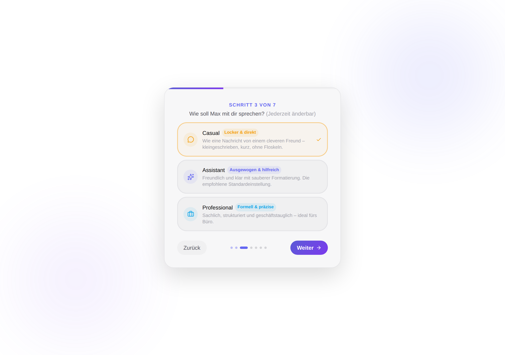
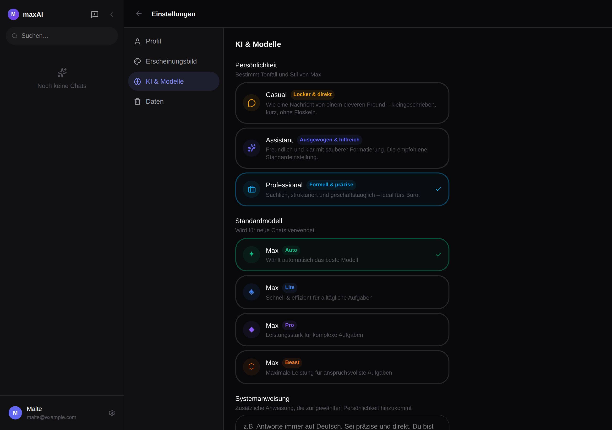

# maxAI – Persönlichkeiten (Casual / Assistant / Professional) + Rebranding

> ℹ️ Erklärdokument zur Pull Request *„Add Casual/Assistant/Professional personalities + maxAI rebranding“*. Es erklärt die Änderungen von Grund auf – überspringe Abschnitte, die du schon kennst.

## Hintergrund

### Für Einsteiger:innen: Wie maxAI aufgebaut ist

maxAI ist eine selbstgehostete Chat-Anwendung im Stil von ChatGPT. Sie besteht aus zwei Teilen:

- **Frontend** (`frontend/`): React + TypeScript, gebaut mit Vite. Hier lebt die Oberfläche – Login, Onboarding, Chat, Einstellungen.
- **Backend** (`backend/`): Node.js + Express + TypeScript. Es spricht mit Azure OpenAI, speichert Daten über **Prisma** in einer PostgreSQL-Datenbank und streamt Antworten per Server-Sent-Events (SSE) zurück an den Browser.

Ein zentrales Konzept bei Sprachmodellen ist der **System-Prompt**: eine unsichtbare Anweisung, die vor der eigentlichen Unterhaltung an das Modell geschickt wird. Sie legt fest, *wer* die KI ist und *wie* sie antwortet. Bisher gab es dafür nur ein einziges, optionales Feld: die frei eingebbare „Systemanweisung“ (`User.systemPrompt`).

> 💡 **System-Prompt** = die Regieanweisung. Der Nutzer sieht sie nicht, aber sie bestimmt Ton, Rolle und Format jeder Antwort.

### Enger gefasst: Was für diese Änderung zählt

Drei Stellen sind relevant:

1. **`backend/src/routes/chat.ts`** – hier wurde bisher `user.systemPrompt` direkt an die Streaming-Funktion übergeben.
2. **`backend/prisma/schema.prisma`** (und die Kopie unter `backend/src/prisma/schema.prisma`, die der Docker-Build nutzt) – das Datenmodell des Users.
3. **Frontend-Onboarding und -Einstellungen** – wo der Nutzer seine Präferenzen setzt.

Wichtig: Es gibt im Repo **keinen `migrations/`-Ordner**. Das Schema ist die einzige Wahrheitsquelle. Das wird im Abschnitt „Code“ noch wichtig.

## Intuition

Die Grundidee: Statt Max nur *eine* Stimme zu geben, bekommt er **drei wählbare Persönlichkeiten**, und der Nutzer entscheidet – beim Onboarding und jederzeit in den Einstellungen.

- **Casual** – locker, kleingeschrieben, kurz, keine Emojis, keine Floskeln. Inspiriert vom „Max“-Charakter: ein cleverer Freund mit der Ruhe eines Türstehers.
- **Assistant** – die ausgewogene Standardstimme: freundlich, klar, saubere Markdown-Formatierung.
- **Professional** – formell, präzise, geschäftstauglich, siezt im Deutschen.

Entscheidend ist, wie Persönlichkeit und die bestehende freie Systemanweisung zusammenspielen. Man kann sie sich als zwei Schichten vorstellen:

> 🧱 **Schicht 1 (Basis):** der Persönlichkeits-Prompt – Identität, Ton, Formatierung.
> **Schicht 2 (darüber):** die optionale eigene Anweisung des Nutzers, die verfeinert, aber die Kernregeln nie überschreibt.

Konkretes Beispiel: Ein Nutzer wählt **Casual** und schreibt zusätzlich „antworte immer auf Englisch“. Ergebnis: Max antwortet englisch, aber weiterhin kleingeschrieben, kurz und ohne Emojis. Die Sprache kommt aus Schicht 2, der Stil aus Schicht 1.

## Code

### Backend: der Persönlichkeits-Service

Neu ist `backend/src/services/personalities.ts`. Er kapselt alles rund um Persönlichkeiten: die IDs, den Default und die drei Prompt-Texte. Ein gemeinsamer `CORE`-Block (Identität „Max von maxAI, erstellt von Malte“ + Sicherheits- und Zuverlässigkeitsregeln) steht in jedem Prompt, damit Identität und Prompt-Injection-Schutz unabhängig vom Ton konstant bleiben.

Die zentrale Funktion kombiniert beide Schichten:

```ts
export function buildSystemPrompt(personality?, userPrompt?): string {
  const base = getPersonalityPrompt(personality); // gültige ID oder Default
  const custom = userPrompt?.trim();
  if (!custom) return base;
  return `${base}

# Additional instructions from the user
...
${custom}`;
}
```

### Backend: Anbindung

- **`chat.ts`** ruft jetzt `buildSystemPrompt(user?.personality, user?.systemPrompt)` auf, statt nur die freie Anweisung durchzureichen.
- **`settings.ts`** nimmt `personality` per Zod-Enum (aus `PERSONALITY_IDS` abgeleitet) entgegen und gibt es zurück.
- **`auth.ts`** liefert `personality` in `register`, `login` und `/me` mit aus.
- **`schema.prisma`** (beide Kopien) bekommt `personality String @default("assistant")`.

### Deploy: `db push` statt `migrate deploy`

Da es keine Migrationsdateien gibt, hätte `prisma migrate deploy` die neue Spalte nie angelegt. `entrypoint.sh` nutzt deshalb jetzt `prisma db push` – das legt die Spalte additiv und ohne Datenverlust an.

```sh
npx prisma db push --schema=./prisma/schema.prisma --skip-generate
```

### Frontend

- Neu: `frontend/src/lib/personalities.ts` – geteilte Definition (Name, Tagline, Beschreibung, Icon, Farbe) für Onboarding und Einstellungen.
- **Onboarding** (`OnboardingFlow.tsx`): neuer Schritt „Persönlichkeit“ zwischen Name und Farbe. Die Schrittlogik wurde von fragilen Zahlen-Indizes auf IDs umgestellt, damit das Einfügen sauber ist.
- **Einstellungen** (`SettingsPage.tsx`): neuer Persönlichkeits-Wähler oben im Bereich „KI & Modelle“.
- `User`-Typ im `authStore` um `personality` erweitert.

### Rebranding

Durchgängig getrennt: **Max** = Name der KI, **maxAI** = Plattform/Projekt. Angepasst wurden u. a. Auth-Überschrift, Sidebar-Wortmarke, Seitentitel/Meta, Backend-Log, README, `.env.example` und `setup.sh`. Der Assistentenname „Max“ und die Modelllinie (Max Lite/Pro/Beast) bleiben bewusst erhalten.

## Verifizierung

Durchgeführte Prüfungen:

- **Frontend Build**: `npm run build` (`tsc -b && vite build`) läuft ohne Fehler durch.
- **Frontend Lint**: `npm run lint` (oxlint) meldet 0 Fehler; die verbleibenden Warnungen sind vorbestehend und stammen nicht aus den geänderten Zeilen.
- **Backend Build**: `npm run build` (`tsc`) kompiliert sauber, `dist/services/personalities.js` wird erzeugt.
- **Logik-Test des Persönlichkeits-Service**: 17 Zusicherungen für `buildSystemPrompt`, `getPersonalityPrompt` und `isPersonalityId` – alle bestanden (u. a. Fallback auf `assistant` bei unbekannter ID, Schichtung der eigenen Anweisung, Ignorieren leerer Anweisungen, gemeinsamer Sicherheits-CORE in allen Prompts).
- **Browser-Test (Playwright)**: Onboarding- und Einstellungsseite gerendert und per Screenshot geprüft (mit gemocktem Backend), hell und dunkel.

### Screenshots

Onboarding – Willkommen (neuer Schrittzähler „1 von 7“):



Onboarding – neuer Schritt „Persönlichkeit“ (Casual ausgewählt):



Einstellungen → „KI & Modelle“ mit Persönlichkeits-Wähler (Dark Mode, Professional ausgewählt):



> ⚠️ Die Prisma-Client-Generierung ließ sich in der Sandbox nicht ausführen (Binär-Download war offline gesperrt, HTTP 403). Der endgültige typisierte Client wird im Docker-Build erzeugt, wo Netzwerkzugriff besteht. Die Schemaänderung folgt exakt dem bestehenden Muster.

So prüfst du manuell:

1. `docker compose up -d --build` starten – der Container legt die Spalte `personality` per `db push` an.
2. Neu registrieren und das Onboarding durchlaufen: nach „Name“ erscheint der Schritt „Persönlichkeit“ mit drei Optionen.
3. **Casual** wählen, Onboarding abschließen, eine Nachricht senden → Antwort ist kleingeschrieben, kurz, ohne Emojis.
4. Einstellungen → „KI & Modelle“ öffnen, auf **Professional** wechseln, speichern, neue Nachricht → Antwort ist formell und strukturiert.
5. Optional eine eigene Systemanweisung (z. B. „antworte auf Englisch“) ergänzen und prüfen, dass die Sprache wechselt, der Stil der Persönlichkeit aber bleibt.

## Alternativen

**Persönlichkeit als eigene Spalte (gewählt) vs. Persönlichkeit in `systemPrompt` hineinschreiben**

| Pro (eigene Spalte) | Contra (eigene Spalte) |
|---|---|
| Klare Trennung von Stil (System) und Nutzerwunsch | Schemaänderung nötig |
| Validierbar per Enum; UI kann auswählen statt frei tippen | Ein zusätzliches Feld über alle Endpunkte zu führen |
| Prompts serverseitig zentral pflegbar | |

Die Variante „alles in `systemPrompt`“ bräuchte keine DB-Änderung, würde aber Nutzereingabe und Systemverhalten vermischen und ließe sich schlecht validieren oder in einer UI auswählen.

## Vorgeschlagene Gesprächspartner:innen

- **Malte** (`Malti2`) – hat maxAI vollständig geschrieben (Initial-Implementierung und Redesign, inkl. `chat.ts`, `azure.ts`, Onboarding und Einstellungen). Er ist die beste Anlaufstelle für Fragen zu Prompt-Fluss, Azure-Anbindung und Deploy.

## Quiz

<details>
<summary>1. Wie hängen Persönlichkeit und die freie Systemanweisung zusammen?</summary>

- A) Die Systemanweisung ersetzt die Persönlichkeit — **falsch**.
- B) Die Persönlichkeit ist die Basis, die Systemanweisung wird darüber gelegt und verfeinert, ohne die Kernregeln zu überschreiben — **richtig** (siehe `buildSystemPrompt`).
- C) Beide werden ignoriert, wenn Auto aktiv ist — **falsch**, das Modell-Routing ist unabhängig vom System-Prompt.
</details>

<details>
<summary>2. Warum wurde in entrypoint.sh von migrate deploy auf db push gewechselt?</summary>

- A) `db push` ist schneller — nicht der Grund.
- B) Das Repo hat keinen `migrations`-Ordner, daher hätte `migrate deploy` die neue Spalte nie angelegt; `db push` synchronisiert das Schema additiv — **richtig**.
- C) `migrate deploy` löscht die Datenbank — **falsch**.
</details>

<details>
<summary>3. Warum steht der CORE-Block in allen drei Prompts?</summary>

- A) Damit Identität (Max/maxAI) und Sicherheitsregeln unabhängig vom gewählten Ton konstant bleiben — **richtig**.
- B) Aus Versehen dupliziert — **falsch**.
- C) Weil Azure das verlangt — **falsch**.
</details>

<details>
<summary>4. Was ist der Standardwert von User.personality?</summary>

- A) `casual` — **falsch**.
- B) `assistant` — **richtig** (`@default("assistant")`), passend zur ausgewogenen Standardstimme.
- C) `null` — **falsch**, das Feld ist nicht optional.
</details>

<details>
<summary>5. Was bedeutet die Rebranding-Regel „Max vs. maxAI“?</summary>

- A) Alles heißt jetzt maxAI, auch die Modelle — **falsch**, Max Lite/Pro/Beast bleiben.
- B) Max ist der Name der KI, maxAI der Name der Plattform/des Projekts; Produktflächen nutzen maxAI, der Assistent bleibt Max — **richtig**.
- C) Max wurde komplett entfernt — **falsch**.
</details>
