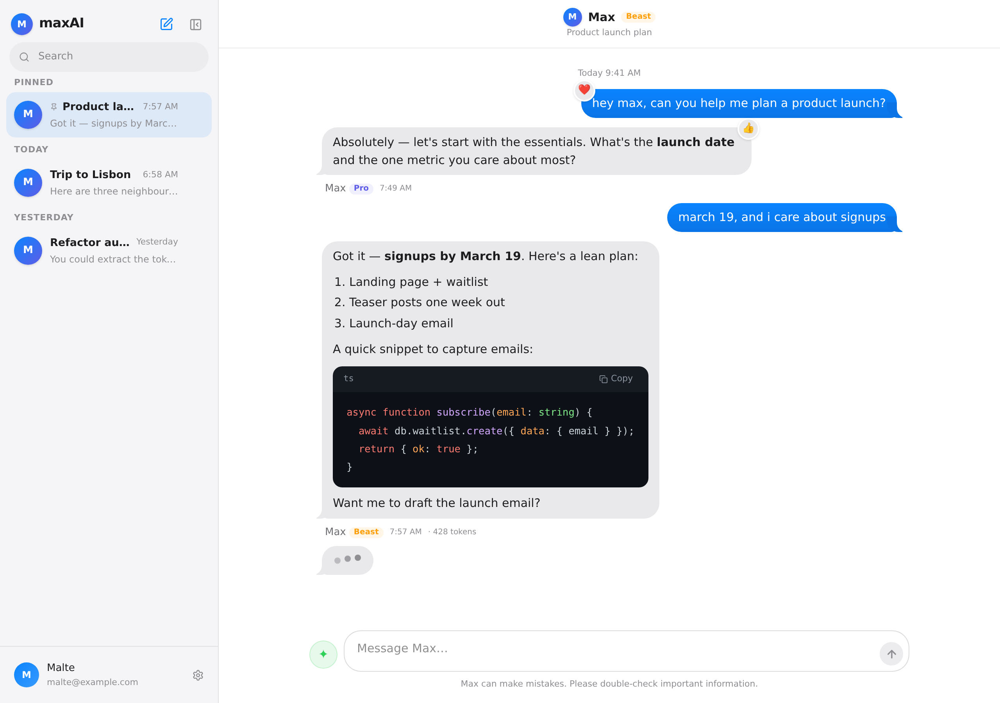
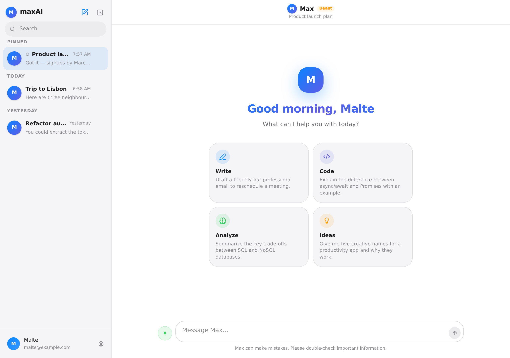
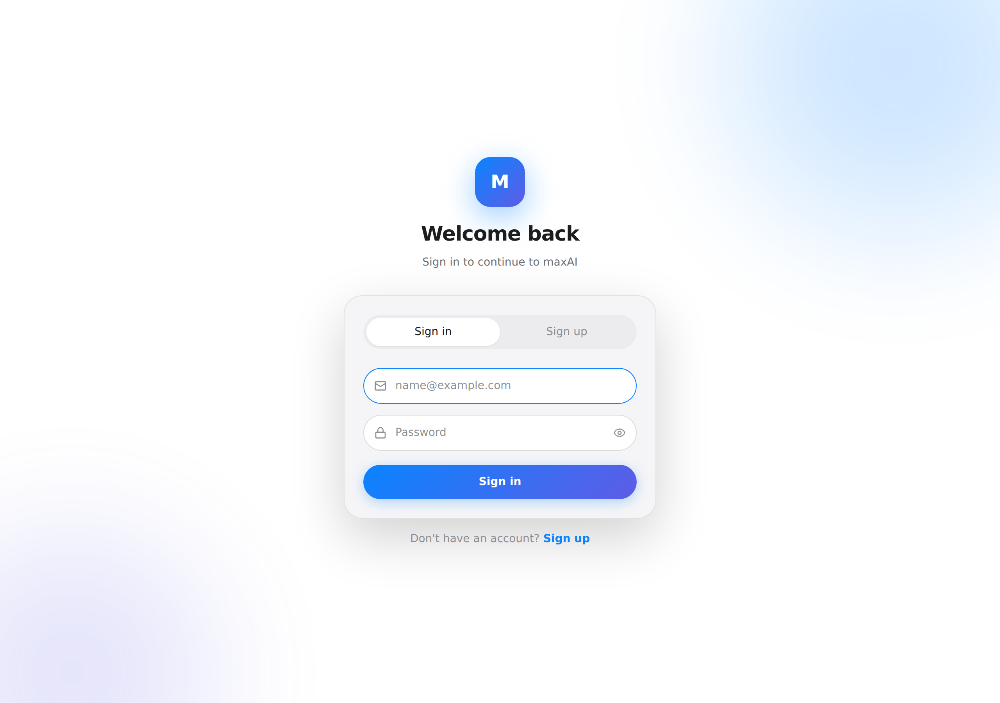
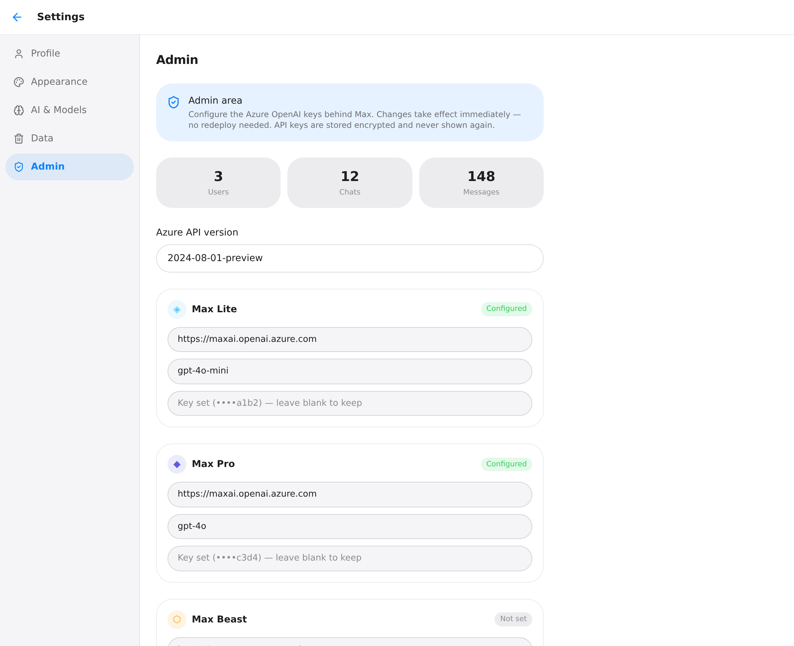

# maxAI 2.0 — iMessage-Redesign, neue Funktionen und Produktionsreife

Dieses Dokument erklärt, was sich in maxAI 2.0 geändert hat: ein Redesign, das
sich wie Apples *Nachrichten*-App anfühlt, mehrere neue Funktionen (Antwort neu
generieren, Nachrichten bearbeiten, Sounds, Tastenkürzel) und eine Reihe von
Änderungen, die aus einem hübschen Prototyp eine Anwendung machen, die man
tatsächlich in Produktion betreiben kann.

> [!NOTE]
> **In einem Satz:** Max spricht jetzt in echten Sprechblasen mit „Tails",
> reagiert mit Tapbacks, tippt in einer grauen Blase — und der Server dahinter
> teilt sich eine Datenbankverbindung, validiert seine Umgebung und bricht
> Modell-Streams sauber ab, wenn niemand mehr zuhört.

## Hintergrund

Wer diese Codebasis noch nie gesehen hat, hier die Landkarte.

maxAI besteht aus einem **Backend** (Node + Express + TypeScript, das über Prisma
mit Postgres und über die OpenAI-Bibliothek mit Azure OpenAI spricht) und einem
**Frontend** (React + Vite, Zustand für den State). Eine Unterhaltung ist eine
Liste von Nachrichten; jede Nachricht hat eine Rolle (`user`, `assistant`,
`system`) und Text. Wenn du etwas sendest, speichert das Backend die Nachricht,
spielt dem Modell die Historie vor und streamt die Antwort Token für Token über
**Server-Sent Events (SSE)** zurück.

> [!NOTE]
> **SSE in einem Satz:** Der Server hält die HTTP-Antwort offen und schreibt
> `data: <json>\n\n`-Blöcke, sobald sie anfallen; der Browser liest sie von
> einem Stream-Reader und aktualisiert die Oberfläche live. So siehst du Max
> „tippen".

Vor 2.0 sah die Oberfläche aus wie ein solider ChatGPT-Klon: Nutzer-Nachrichten
in einer violetten Blase rechts, Max-Antworten links als flacher Markdown-Block
mit Avatar und Namen darüber. Funktional — aber weit entfernt von dem
iMessage-Gefühl, das gewünscht war. Und unter der Haube gab es ein paar stille
Probleme, die in Produktion weh getan hätten.

Die drei wichtigsten Baustellen, die 2.0 angeht:

1. **Es sah nicht nach iMessage aus.** Nur eine Seite hatte Sprechblasen.
2. **Ein paar echte Bugs.** Zwei davon waren im Alltag spürbar (siehe unten).
3. **Nicht produktionsreif.** Jede Route erzeugte ihren eigenen `PrismaClient`,
   es gab keine zentrale Fehlerbehandlung, keine Env-Validierung, kein Graceful
   Shutdown, und ein abgebrochener Stream lief serverseitig einfach weiter.

## Intuition

### Das Design: von „Chat-App" zu „Nachrichten"

Der Kern der visuellen Änderung ist eine einzige Idee: **beide Gesprächspartner
bekommen echte Sprechblasen.** In iMessage sind ausgehende Nachrichten blaue
Blasen rechts, eingehende graue Blasen links, und die letzte Blase einer Gruppe
trägt einen kleinen „Tail" (die Spitze, die zur sprechenden Person zeigt).

Der Tail ist kein Bild. Er entsteht aus zwei Pseudo-Elementen: Das erste malt
eine runde Ecke in der Blasenfarbe, das zweite „stanzt" mit der Seitenfarbe des
Hintergrunds ein Stück wieder heraus — übrig bleibt die charakteristische
Spitze.

```css
.bubble-in.tail::before {  /* runde Ecke in Blasenfarbe */
  content: ""; position: absolute; bottom: 0; left: -7px;
  width: 20px; height: 20px; background: var(--imsg-in);
  border-bottom-right-radius: 15px;
}
.bubble-in.tail::after {   /* mit Hintergrundfarbe wieder ausstanzen */
  content: ""; position: absolute; bottom: 0; left: -14px;
  width: 14px; height: 20px; background: var(--bg);
  border-bottom-right-radius: 12px;
}
```

Nachrichten werden außerdem **gruppiert**: Folgen mehrere Nachrichten derselben
Seite kurz hintereinander, rücken sie eng zusammen und nur die letzte trägt
einen Tail — genau wie in iMessage. Zwischen größeren Zeitlücken erscheint ein
zentrierter Zeitstempel („Heute 9:41"), und unter deiner letzten gesendeten
Nachricht steht „Delivered".

> [!NOTE]
> **Warum kein 1:1-Klon von Apple?** Aus Copyright-Gründen ist das Design
> *inspiriert*, nicht kopiert: eigene Markenfarbe (ein Blau-zu-Indigo-Verlauf für
> das „M"), iOS-*System*farben für die Modelle, synthetisch erzeugte Sounds statt
> Apples Original-Tönen, und die SF-Schrift wird nur dort genutzt, wo das
> Betriebssystem sie ohnehin bereitstellt (`-apple-system`), mit Inter als
> Fallback.

### Die Bugs

Zwei Fehler waren subtil, aber real:

**1. Der Stream schrieb im Chat-Modus in die falsche Nachricht.** Die alte
`updateLastMessage(content)` aktualisierte immer das *letzte* Element im
Nachrichten-Array. Solange Max antwortete, war das die Assistenten-Blase. Sobald
du im Chat-Modus aber eine weitere Nachricht in die Warteschlange legtest, wurde
*deine* Nachricht das letzte Element — und der Antwort-Stream überschrieb ihren
Text.

*Fix:* Nachrichten werden jetzt **per ID** aktualisiert
(`updateMessageContent(id, content)`), nie „per Position".

**2. Jede Nachricht benannte die Unterhaltung um.** Der Titel wurde clientseitig
bei *jeder* Antwort auf den zuletzt gesendeten Text gesetzt. Nach der zweiten
Nachricht hieß dein Chat also plötzlich anders.

*Fix:* Der Titel wird nur noch beim **ersten** Austausch gesetzt (`titleSeed`).

Dazu ein dritter, leiser Bug: `register` gab kein `systemPrompt` zurück, sodass
frisch registrierte Nutzer:innen bis zum nächsten Login ein unvollständiges
Profil hatten. Ein zentraler `toPublicUser()`-Serializer beseitigt diese ganze
Fehlerklasse.

### Neu generieren & bearbeiten

Beide Funktionen bauen auf derselben Einsicht: „eine Assistenten-Antwort
erzeugen" ist immer derselbe Ablauf. **Neu generieren** verwirft Max' letzte
Antwort und erzeugt aus demselben Verlauf eine neue. **Bearbeiten** ändert eine
deiner Nachrichten, verwirft alles danach und setzt von dort neu auf — wie das
Bearbeiten eines Prompts in einer Chat-App.

## Code

### Frontend

**Design-System (`index.css`).** Neue Farbvariablen (iMessage-Blau, iOS-Grautöne,
pures Schwarz im Dark Mode), ein SF-first Schriftstack, die Bubble-/Tail-Klassen,
eine „Tippen"-Blase und eine dezente `bubble-in`-Feder-Animation.

**Nachrichtenblasen (`MessageBubble.tsx`).** Beide Rollen rendern jetzt als Blase.
Die Assistenten-Blase enthält weiterhin vollständiges Markdown — inklusive
**Syntax-Highlighting** über `highlight.js` (die Abhängigkeit war vorher
installiert, aber ungenutzt). Nutzer-Blasen lassen sich **inline bearbeiten**.

```tsx
<div className={`bubble bubble-in ${tail ? 'tail' : ''}`}>
  {isThinking
    ? <div className="typing-dots"><span/><span/><span/></div>
    : <ReactMarkdown …>{message.content}</ReactMarkdown>}
</div>
```

**Ein Stream-Hook für alles (`useChat.ts`).** Senden, Neugenerieren und
Bearbeiten teilen sich eine `runStream()`-Funktion, die die SSE-Events
verarbeitet, temporäre Nachrichten sauber durch die persistierten ersetzt, die
Sounds auslöst und Fehler über Toasts meldet.

**Weitere Bausteine:** `lib/sounds.ts` (WebAudio-Synth), `store/toastStore.ts` +
`Toaster.tsx`, `ShortcutsModal.tsx` (⌘/), die Messages-artige `Sidebar.tsx` mit
Vorschau-Snippet, und ein aufgeräumter Empty-/Auth-/Onboarding-Screen. Toter Code
(`Button.tsx`, `Input.tsx`, `App.css`, die Vite-Beispiel-Assets) wurde entfernt.

### Backend

**Ein gemeinsamer Prisma-Client (`lib/prisma.ts`).** Statt eines Pools pro
Route-Datei jetzt genau eine Instanz — wichtig, damit Postgres-Verbindungen nicht
ausgehen.

**Validierte Umgebung (`lib/env.ts`).** Fehlt `JWT_SECRET` (oder ist er in
Produktion zu kurz), bricht der Start mit einer klaren Meldung ab, statt tief in
einem Request zu scheitern.

**Zentrale Fehlerbehandlung (`middleware/error.ts` + `lib/asyncHandler.ts`).** Ein
Request-Logger, ein 404-Handler und ein Error-Handler, der Zod- und
JSON-Fehler in saubere 4xx-Antworten übersetzt und sonst nie Interna preisgibt.

**Geteilte Streaming-Pipeline (`services/chatStream.ts`).** `streamAssistantTurn`
kapselt Modellwahl, Token-Streaming, das Herausfiltern des Chat-Mode-Steuerblocks,
Tapback/Reply und das Persistieren der Antwort. Die Route bricht den Upstream ab,
sobald der Client die Verbindung trennt:

```ts
const controller = new AbortController();
req.on('close', () => controller.abort());  // Client weg → Modell-Stream stoppen
```

**Neue Endpunkte (`routes/chat.ts`).**

- `POST /api/chat/conversations/:id/regenerate`
- `PUT  /api/chat/conversations/:id/messages/:messageId` (bearbeiten & neu streamen)

**Schema & Migration.** Neue Felder `User.soundEnabled` und `Message.edited`, dazu
zwei Indizes (`Message(conversationId, createdAt)` und
`Conversation(userId, updatedAt)`) für die häufigen Abfragen.

## Verifizierung

- ✅ **Backend `npm run build`** (tsc) — sauber
- ✅ **Frontend `npm run build`** (tsc + vite) — sauber, keine Chunk-Warnung
- ✅ **`oxlint`** — 0 Fehler, 5 (vorbestehende) Hook-Deps-Hinweise
- ✅ **`npm test`** (Backend) — **319 Assertions grün**: Stream-Parser (279),
  `buildModelHistory` (19) und Unit-Tests (21) für `selectAutoModel`,
  `resolveModel`, `toPublicUser` sowie die Verschlüsselung (`encrypt`/`decrypt`/`mask`)
- ✅ **Server-Boot-Smoke-Test**: `/health` (ok), `/api/nope` (404),
  `/api/admin/config` ohne Token (401), fehlerhaftes JSON (400) — Fehler-Handler
  und Auth-Gate greifen
- ✅ **Visueller Test** in Headless-Chromium (Light + Dark, Chat, Empty, Auth,
  Settings, Onboarding, Admin) — siehe Screenshots unten

> [!WARNING]
> **Sandbox-Einschränkung:** Der Prisma-Engine-Download ist in der Build-Umgebung
> per HTTP 403 blockiert, daher ließ sich der Server dort nicht vollständig
> booten (`prisma generate` und `migrate deploy` laufen im Docker-Build mit
> Netzwerkzugriff). Die Migration folgt Prismas Format und ist rein additiv.

So prüfst du es manuell:

1. `cp .env.example .env` und Azure-/DB-Werte eintragen, dann `docker compose up -d --build`.
2. Registrieren → Onboarding durchlaufen.
3. Eine Nachricht senden: Blase rechts, Tippblase links, dann Max' Antwort mit
   Modell-Badge und Zeit. Ton beim Senden/Empfangen (in Einstellungen
   abschaltbar).
4. Über Max' letzter Antwort **Neu generieren** klicken → neue Antwort.
5. Über einer eigenen Nachricht **Bearbeiten** → Text ändern → Alles danach wird
   ersetzt.
6. Chat-Modus in den Einstellungen einschalten → Tapbacks & Antworten testen,
   während Max noch schreibt eine weitere Nachricht schicken.
7. ⌘K neuer Chat, ⌘B Seitenleiste, ⌘/ Kürzelübersicht. Dark Mode umschalten.

### Screenshots

**Chat (Light)**



**Chat (Dark)**


**Empty State**



**Login**



## Installer & Admin-Bereich

Ein zweiter Teil von 2.0 macht das Selbst-Hosten kinderleicht und die Keys zur
Laufzeit editierbar.

### Ein-Kommando-Installer

`setup.sh` ist jetzt interaktiv und turnkey: Es installiert Docker (auf Wunsch),
**generiert alle Secrets** (Postgres-Passwort, `JWT_SECRET`, `ENCRYPTION_KEY`),
fragt nach Port/Domain, einem **Admin-Konto** und — optional — den Azure-Keys,
schreibt eine `.env` und startet den Stack. Secrets werden bei erneutem Ausführen
**bewahrt** (kein versehentliches Rotieren von `JWT_SECRET`, das alle ausloggen
würde), und Azure-Keys darf man leer lassen und später im Browser eintragen.

### Wie „nur ich" garantiert wird

Admin-Zugriff hängt **ausschließlich** an `ADMIN_EMAIL` in der `.env` — nicht an
einer Datenbank-Spalte, die man manipulieren könnte:

```ts
export function isAdminEmail(email?: string | null): boolean {
  const admin = loadEnv().ADMIN_EMAIL;
  return !!admin && !!email && email.trim().toLowerCase() === admin;
}
```

Damit niemand die Admin-Adresse per offener Registrierung „vorwegnimmt", wird das
Konto beim ersten Start aus `ADMIN_EMAIL` + `ADMIN_PASSWORD` **angelegt**
(`ensureAdminUser`). Ein `requireAdmin`-Middleware schützt alle `/api/admin`-Routen.

> [!IMPORTANT]
> Admin-Status ist rein env-gesteuert. Selbst wer sich Datenbankzugriff
> verschafft, kann sich damit **keinen** Admin-Zugang verschaffen.

### Keys zur Laufzeit ändern

Die Azure-Konfiguration wird in dieser Reihenfolge aufgelöst: **DB-Einstellung →
Umgebungsvariable → Default**. Der Admin-Bereich (Einstellungen → Admin)
schreibt DB-Overrides; API-Keys werden mit **AES-256-GCM verschlüsselt**
gespeichert (Schlüssel aus `ENCRYPTION_KEY` oder abgeleitet aus `JWT_SECRET`) und
nie wieder im Klartext ausgegeben — die Oberfläche zeigt nur einen maskierten
Hinweis wie `••••a1b2`. Ein kleiner Cache (5 s, invalidiert beim Speichern) hält
das Streaming schnell. Ein „Verbindung testen"-Knopf schickt eine 1-Token-Anfrage
pro Modell.



## Alternativen

**Sprechblasen-Tails: CSS-Pseudo-Elemente vs. SVG-Masken**

| CSS-Pseudo-Elemente (gewählt) | SVG-Maske pro Blase |
|---|---|
| ✅ Kein zusätzliches Markup, folgt der Bubble-Farbe über Variablen | ✅ Pixelgenaue, identische Form |
| ✅ Trivial in Light/Dark, keine Assets | ❌ Mehr DOM/Assets, Verläufe in Masken sind fummelig |
| ❌ „Ausstanzen" braucht eine flache Hintergrundfarbe | ✅ Unabhängig vom Hintergrund |

Da der Nachrichtenbereich eine einfarbige Fläche (`var(--bg)`) ist, gewinnt die
CSS-Variante klar an Einfachheit.

**Bearbeiten: Verlauf abschneiden vs. verzweigen**

| Abschneiden & neu streamen (gewählt) | Versionierte Zweige |
|---|---|
| ✅ Einfaches, vorhersehbares mentales Modell (wie ChatGPT) | ✅ Nichts geht verloren, Versionen umschaltbar |
| ✅ Kein Schema für Baumstrukturen nötig | ❌ Deutlich komplexer in Schema, API und UI |
| ❌ Nachrichten nach der Bearbeitung gehen verloren | ✅ Volle Historie |

Für den Umfang dieser Anwendung ist das Abschneiden die richtige Wahl; Zweige
wären ein eigenes, größeres Feature.

## Vorgeschlagene Gesprächspartner:innen

Alle bisherigen Commits an den geänderten Dateien stammen vom KI-Agenten
(`Claude`), mit Malte als Co-Autor. Für Fragen zum Kontext ist daher **Malte**
(Repo-Eigentümer) die richtige Anlaufstelle — insbesondere zu den Azure-Deployments
(`AZURE_DEPLOYMENT_*`) und dazu, welche Modelle „Lite/Pro/Beast" in der Produktion
zugeordnet sind, da das die Auto-Auswahl und die Kosten beeinflusst.
