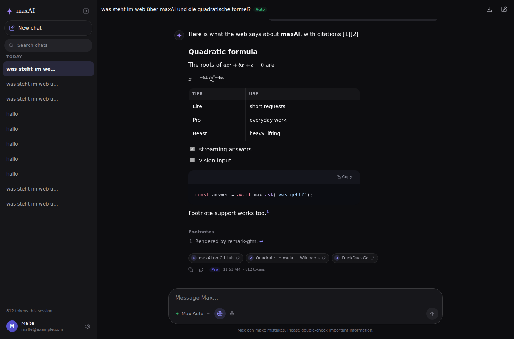
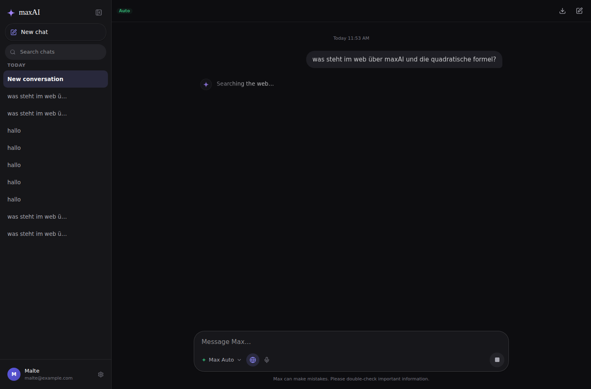
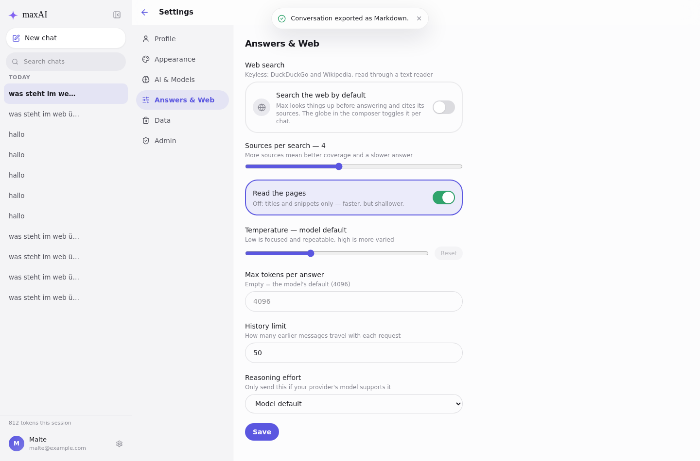
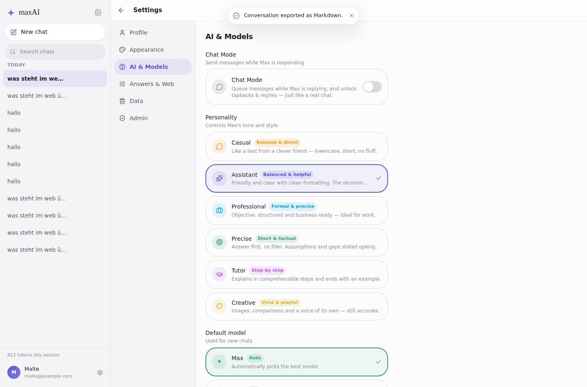
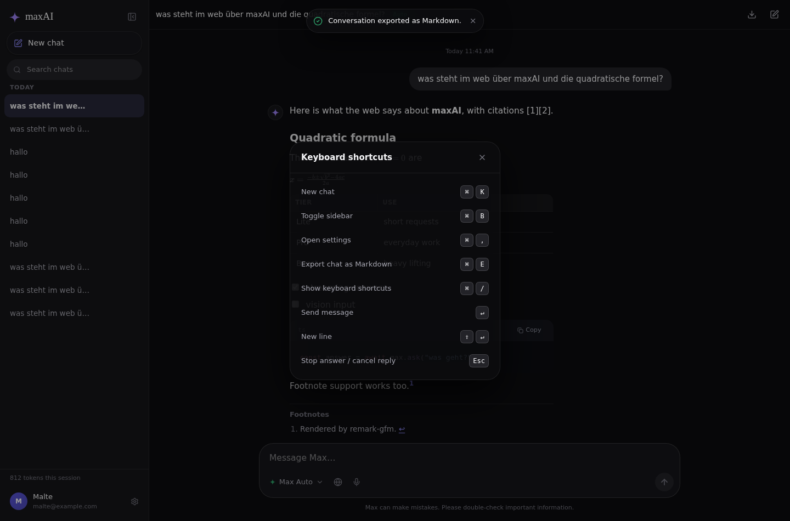

# maxAI — Web-Suche ohne Key, Antwort-Feineinstellungen und Ein-Befehl-Installation

> Erklärungsdokument zur Draft-PR. Es erklärt die Änderungen von Grund auf —
> überspringe Abschnitte, die du schon kennst.

## Hintergrund

**maxAI** ist eine selbstgehostete Chat-Anwendung. **Max** ist der Name der KI,
**maxAI** die Plattform. Der Stack:

- **Frontend** (`frontend/`): React 19 + TypeScript + Tailwind CSS v4 (Vite).
  Zustand für State, Server-Sent-Events (SSE) fürs Streaming.
- **Backend** (`backend/`): Node.js + Express + TypeScript. Spricht über einen
  Chat-Completions-kompatiblen Endpunkt mit dem KI-Anbieter, speichert per Prisma
  in PostgreSQL, streamt Antworten per SSE.
- **Infrastruktur**: `docker-compose.yml` mit postgres + backend + web (nginx),
  ein öffentlicher Port. `setup.sh` ist der Installer.

Ausgangspunkt dieser Änderung war ein Vergleich mit einem **Einzeldatei-Prototyp**
(eine HTML-Datei, die direkt gegen OpenRouter spricht). Dieser Prototyp konnte
einige Dinge, die dem Hauptprojekt fehlten:

| Prototyp | maxAI vorher |
|----------|--------------|
| Web-Suche ohne Such-API-Key, mit Quellen-Chips | fehlte komplett |
| LaTeX/KaTeX, Fußnoten, Task-Listen | nur Tabellen/Code |
| Temperature, Max-Tokens, Verlauf-Limit, Reasoning-Effort | serverseitig fest verdrahtet |
| Chat als Markdown exportieren | fehlte |
| Diktieren per Mikrofon | fehlte |
| Token-Zähler pro Session | nur pro Antwort |
| 7 Konversationsstile | 3 Persönlichkeiten |
| Shortcuts für Einstellungen/Stop | ⌘K, ⌘B, ⌘/ |

Zweiter Auftrag: **die Installation soll sehr einfach sein, auch auf Ubuntu.**
Vorher gab es `setup.sh` (interaktiv, Docker-Pflicht), aber: keine Möglichkeit
für eine unbeaufsichtigte Installation, ein harter Abbruch, wenn das
Compose-Plugin fehlte (auf Ubuntu ein separates Paket), keine Prüfung, ob die App
danach wirklich antwortet, und für den Alltag musste man Docker-Compose-Befehle
kennen.

## Intuition

**Web-Suche ohne zweiten Key.** Der Prototyp sucht im Browser — das geht nur mit
CORS-Umwegen und legt die Suchlogik in die Hand des Clients. In maxAI läuft die
Suche **auf dem Server**, direkt in dem Turn, der ohnehin gerade streamt:

```
Nachricht ──▶ DuckDuckGo Instant Answer (kurzer Abstract)
          ──▶ DuckDuckGo HTML-Trefferliste (Titel + Links)
          ──▶ Wikipedia (Fallback, wenn beides leer bleibt)
                     │
                     └─▶ r.jina.ai liest jede Seite als Text
                                │
                                └─▶ nummerierter Kontextblock → System-Prompt
```

Der Kontextblock ist nummeriert (`[1] Titel / URL / Text`), und der Prompt bittet
um genau diese Zitate im Text. Die Oberfläche zeigt die Quellen als Chips —
Nummer, Titel, Link — unter der Antwort.

**Beispiel:** Frage „was steht im web über maxAI und die quadratische formel?" →
Status „Searching the web…", dann „Reading sources…", dann streamt die Antwort mit
`[1][2]` im Text und drei Chips darunter.




Wichtig: Der Suchkontext ist **pro Turn**. Er wandert nicht in die
Konversationshistorie, sonst würde ein langer Chat langsam mit altem Seitentext
volllaufen. Gespeichert werden nur Titel, URL und Snippet an der Antwort — damit
die Chips einen Reload und den Markdown-Export überleben.

**Installation.** Die Leitidee: ein Befehl auf einem frischen Ubuntu, und danach
braucht man kein Docker-Wissen mehr.

```bash
curl -fsSL https://raw.githubusercontent.com/Malti2/maxAI/master/install.sh | bash
```

Danach übernimmt `./maxai` den Alltag (`start`, `logs`, `update`, `backup`,
`doctor`, …).

## Codeänderungen

### 1. Web-Suche (`backend/src/services/websearch.ts`, neu)

Drei keylose Anbieter plus ein Reader, jeder Aufruf zeitlich und in der Größe
begrenzt, jeder Fehler geschluckt: Web-Suche ist eine Verbesserung, nie eine
Voraussetzung für eine Antwort.

```ts
export async function webSearch(message: string, options: WebSearchOptions = {}) {
  if (!isWebSearchEnabled()) return null;
  const query = buildQuery(message);            // Codeblöcke raus, 400 Zeichen max
  options.onPhase?.('searching');

  const [results, instant] = await Promise.all([
    duckDuckGoResults(query, maxSources, options).catch(() => []),
    duckDuckGoInstantAnswer(query, options).catch(() => null),
  ]);
  // … Instant Answer führt, dann die Trefferliste, Wikipedia als Fallback
  if (sources.length === 0) return null;        // Aufrufer antwortet ohne Web
  if (options.readPages) { options.onPhase?.('reading'); /* Reader parallel */ }
  return { sources, context: buildContext(sources) };
}
```

Die HTML-Trefferliste wird mit toleranten Regexen geparst (kein zusätzliches
Dependency), Entities werden dekodiert und DuckDuckGos Redirect-Wrapper
(`/l/?uddg=…`) aufgelöst.

**Sicherheit.** Treffer-URLs sind fremdbestimmte Eingabe, deshalb gilt vor jedem
Fetch und vor jeder Anzeige `isPublicHttpUrl()`: nur `http`/`https`, kein
Loopback, keine privaten Netze, kein `169.254.169.254`. Damit kann ein
manipulierter Treffer die Suche nicht in eine Anfrage gegen das eigene Netz oder
den Cloud-Metadaten-Endpunkt verwandeln. Zusätzlich sagt der Prompt explizit,
dass Seitentext **Daten und keine Anweisungen** sind, und die Chips im Frontend
prüfen das Schema noch einmal.

### 2. Verdrahtung im Turn (`routes/chat.ts`, `services/chatStream.ts`)

Die Suche läuft, **nachdem** der SSE-Stream offen ist. So kann die Oberfläche
sagen, was passiert — und *Stop* bricht auch eine laufende Suche ab, weil das
`AbortSignal` des Requests durchgereicht wird:

```ts
const controller = openSSE(req, res);
sse(res, { type: 'user_message', message: userMsg });

const web = useWebSearch
  ? await gatherWebContext(res, lastUserMsg.content, user, controller.signal)
  : null;
if (web) systemPrompt = `${systemPrompt}\n\n${web.prompt}`;
```

`gatherWebContext()` schickt `{type:'search',state:'searching'|'reading'}` und
danach `{type:'sources',…}`; `chatStream.ts` speichert die Zitate an der Antwort
(`Message.sources`). Alle drei streamenden Endpunkte (senden, neu generieren,
Nachricht bearbeiten) nutzen denselben Weg.

### 3. Antwort-Feineinstellungen (`services/generation.ts`, neu)

Temperature, Max-Tokens, Verlauf-Limit und Reasoning-Effort liegen jetzt am
Benutzer. Geklemmt wird **einmal**, zentral — ein Unsinnswert darf nie beim
Anbieter landen, weil der den ganzen Turn mit einem undurchsichtigen 400 quittiert:

```ts
export function resolveGenerationSettings(input?: GenerationSettingsInput | null): GenerationSettings {
  const temperature = isFiniteNumber(input?.temperature)
    ? clamp(input!.temperature!, 0, 2) : undefined;   // undefined = Tier-Default
  …
}
```

`streamChat()` nimmt jetzt ein Options-Objekt und schickt `reasoning_effort`
**nur**, wenn es gesetzt ist — Anbieter ohne Reasoning lehnen unbekannte
Parameter sonst ab. Das Verlauf-Limit begrenzt zusätzlich die geladenen Zeilen
(`MAX_HISTORY_ROWS`).



### 4. Reichere Antworten (`MessageBubble.tsx`, `index.css`)

`remark-math` + `rehype-katex` kommen zu `remark-gfm` dazu, KaTeX-CSS wird
**lokal** gebündelt (kein CDN). Fußnoten und Task-Listen bekommen Styles; KaTeX
landet über `manualChunks` in einem eigenen, separat cachebaren Chunk, damit der
Markdown-Chunk klein bleibt.

### 5. Kleine Bausteine

- `frontend/src/lib/speech.ts` — Diktieren über die Web-Speech-API, komplett
  gekapselt; das Mikrofon erscheint nur, wo der Browser es kann.
- `frontend/src/lib/exportChat.ts` — Konversation als Markdown, inklusive
  Quellenliste. Rein clientseitig, kein Endpunkt.
- Token-Zähler pro Session in der Sidebar, Shortcuts ⌘, (Einstellungen),
  ⌘E (Export), Esc (Antwort stoppen).
- Drei weitere Persönlichkeiten (Precise, Tutor, Creative) — jetzt sechs, dazu
  ein Web-Suche-Schritt im Onboarding.




### 6. Bugfix: das Streaming der ersten Nachricht war unsichtbar

Beim Vermessen der neuen Statuszeile fiel auf, dass sie in einem **neuen** Chat
nie erschien — und mit ihr auch nicht der Tipp-Indikator und das eigentliche
Streaming. Der Fehler existiert auch auf `master` (nachgestellt in einem
`git worktree` gegen denselben Mock-Server): Man sah beim ersten Austausch bis zur
fertigen Antwort **nichts**.

Ursache: `sendMessage()` legt die Konversation an, navigiert zu `/chat/:id` und
fügt danach die optimistischen Nachrichten ein. Die Ladelogik der Chat-Seite
verglich `id !== activeConversationId` — zwei Zustände aus zwei Welten (Router
und Zustand-Store). Committete React die Navigation zuerst, lud die Seite die
gerade erzeugte Konversation nach und ersetzte die Nachrichtenliste durch das,
was der Server bisher kannte: nichts.

Die Lösung macht das Eigentum an der Liste explizit statt es zu erraten. Der
Store weiß jetzt, **zu welcher Konversation** seine Nachrichten gehören:

```ts
setMessages: (messages, conversationId) =>
  set((s) => ({
    messages,
    messagesConversationId: conversationId !== undefined ? conversationId : s.activeConversationId,
  })),
```

`sendMessage()` beansprucht die Liste synchron, **bevor** navigiert wird
(`setMessages([], data.id)`), und die Chat-Seite lädt nur nachträglich, wenn die
Liste zu einer anderen Konversation gehört. Damit spielt die Reihenfolge der
Renders keine Rolle mehr.

### 7. Installation

**`install.sh` (neu)** — der Ein-Zeiler: installiert bei Bedarf git/curl/Docker,
klont oder aktualisiert `~/maxAI` und übergibt an `setup.sh`. Der Kniff für den
Pipe-Aufruf: `curl … | bash` belegt stdin, deshalb liest der Installer seine
Fragen aus `/dev/tty` — und läuft ohne Terminal automatisch unbeaufsichtigt.

```bash
if [ -e /dev/tty ] && [ -r /dev/tty ]; then
  bash setup.sh ${MAXAI_ARGS:-} < /dev/tty
else
  bash setup.sh --yes ${MAXAI_ARGS:-}
fi
```

**`setup.sh`** — Flags für jede Frage (`--yes`, `--port`, `--admin-email`,
`--ai-api-key`, …), Werte kommen aus Flag → Umgebung → bestehender `.env` →
Default (Secrets werden also bei einem erneuten Lauf nie neu erzeugt). Fehlt das
Compose-Plugin, wird `docker-compose-plugin` per apt nachinstalliert statt
abzubrechen. Ein belegter Port wird gewarnt, und nach dem Start wird bis zu drei
Minuten auf `/health` gepollt — schlägt das fehl, kommen direkt die letzten
40 Log-Zeilen. `--no-start` schreibt nur die Konfiguration.

**`maxai` (neu)** — das Alltagswerkzeug: `start`, `stop`, `restart`, `status`,
`logs`, `update`, `backup`, `restore`, `doctor`, `uninstall`. Docker wird erst
geprüft, wenn ein Befehl es braucht (`./maxai help` funktioniert auch ohne), und
fällt automatisch auf `sudo` zurück.

**`docker-compose.yml`** — `web` wartet jetzt auf einen **gesunden** Backend
(`condition: service_healthy`), damit der erste Seitenaufruf keinen 502 sieht;
dazu die drei `WEB_SEARCH_*`-Variablen.

### 8. Datenbank

Eine Migration (`20260201000000_add_web_search_and_generation`) ergänzt sieben
Spalten an `User` (Web-Suche-Präferenzen + Generierung) und `Message.sources`
(JSONB). Alle mit Defaults bzw. nullable — bestehende Zeilen brauchen keine
Datenwanderung, `prisma migrate deploy` läuft beim Containerstart.

## Verifizierung

**Automatisiert (ausgeführt, grün):**

| Prüfung | Ergebnis |
|---------|----------|
| `backend: npx tsc --noEmit` | 0 Fehler |
| `backend: npm test` | 396 Assertions grün (279 chatMode, 19 buildModelHistory, 23 units, 20 generation, 55 websearch) |
| `frontend: npm run lint` (oxlint) | 0 Warnungen, 0 Fehler |
| `frontend: npm run build` (tsc -b + vite) | erfolgreich |
| `bash -n` für `setup.sh`, `install.sh`, `maxai` | syntaktisch in Ordnung |

Die 55 neuen Web-Suche-Assertions decken URL-Härtung (privat/Loopback/`javascript:`),
das Parsen von DuckDuckGo-HTML (inklusive Duplikaten, Ads, Entities), Instant
Answer, Wikipedia, den Kontextaufbau sowie die Orchestrierung mit einem
gestubbten `fetch` ab — Wikipedia-Fallback, „alles schlägt fehl → `null`",
abgeschaltete Suche → **kein** HTTP-Aufruf, und die Reihenfolge der
Phasen-Callbacks. Die Generierungs-Tests prüfen Defaults, Klemmung und die
Ablehnung von `NaN`/Strings/unbekannten Effort-Werten.

**Manuell im Browser (Chromium, hell und dunkel, 28/28 Prüfungen grün):**

Da der Sandbox-Umgebung die Prisma-Query-Engine und PostgreSQL fehlen, lief das
echte Frontend gegen einen **Mock-Backend**, das dasselbe SSE-Protokoll spricht
(`user_message`, `model`, `search`, `sources`, `delta`, `done`). Geprüft wurden:
Statuszeile „Searching the web…" → „Reading sources…", Quellen-Chips, KaTeX
(inline + abgesetzt), Tabellen/Task-Listen/Fußnoten/Code-Copy, Folgenachricht im
selben Chat, Wiederherstellung nach Reload, Globus aus → keine Suchphase,
⌘K/⌘,/⌘/-Shortcuts, Markdown-Export (Datei enthält Quellen und Formeln),
Konversationswechsel über die Sidebar, sechs Persönlichkeiten. Keine
Konsolenfehler. Die Screenshots in diesem Dokument stammen aus diesem Lauf; die
Antworttexte sind entsprechend Beispieldaten.

**Installer:** In Kopien des Repos verifiziert — unbeaufsichtigt mit Flags,
per Umgebungsvariablen, interaktiv über ein Pseudo-Terminal (alle Prompts,
inklusive verdecktem Passwort) und ein zweiter Lauf, der Secrets und Port
unverändert lässt. Ebenso `./maxai help` und `./maxai doctor` ohne laufenden
Docker-Daemon.

**Bekannte Einschränkungen:**

- `docker compose up` selbst und ein echter Provider-Aufruf konnten hier nicht
  ausgeführt werden (kein Docker-Daemon, kein Netzzugang zu Prisma-Engines,
  Suchmaschinen oder Modell-Anbietern in der Sandbox). Beides bleibt am ersten
  echten Deployment zu bestätigen.
- **Bild-/Vision-Eingabe** aus dem Prototyp ist bewusst nicht enthalten: Sie
  braucht eine Entscheidung über Speicherung (Data-URLs in der DB vs. Objekt-Ablage),
  angepasste Upload-Limits in nginx und ein multimodales Nachrichtenformat. Das
  ist eine eigene, gut abgrenzbare Änderung — und ohne Vision-Anbieter hier auch
  nicht ehrlich testbar.

### Selbst nachprüfen

```bash
cd backend && npm install && npm test        # Web-Suche + Generierung + Bestand
cd ../frontend && npm install && npm run build

# komplett hochfahren
bash setup.sh            # oder: bash setup.sh --yes --port 8080 …
./maxai status
```

Dann im Browser: Globus im Composer an, „was ist heute in der tech-welt
passiert?" fragen — Statuszeile, Chips und `[1]`-Zitate erscheinen. In
**Einstellungen → Answers & Web** Temperature/Quellenzahl ändern, mit ⌘E
exportieren.

## Alternativen

| Alternative | Abwägung |
|-------------|----------|
| Bezahl-Such-API (Brave, Tavily, Serper) | Stabile, saubere Ergebnisse, aber ein **zweiter Key** für jeden Selbsthoster — genau die Hürde, die dieses Feature vermeiden soll. Der Anbieter ist über `WEB_SEARCH_*` austauschbar, ein Upgrade bleibt also möglich |
| Suche im Browser wie im Prototyp | Kein Server-Traffic, aber CORS-Umwege, Such-Logik im Client und keine Möglichkeit, Zitate an der Nachricht zu speichern |
| Seiten selbst holen und HTML parsen | Kein Drittanbieter-Reader, aber deutlich mehr Code (Boilerplate-Entfernung, Zeichensätze, PDFs) und ein direkter Fetch auf jede Treffer-URL — genau das SSRF-Risiko, das wir vermeiden. `WEB_SEARCH_READER_URL` erlaubt eine selbstgehostete Reader-Instanz |
| Generierungs-Parameter admin-global statt pro Benutzer | Weniger Zustand, aber Temperature ist eine persönliche Vorliebe; Anbieter/Modelle bleiben admin-global |
| KaTeX dynamisch nachladen | Spart ~88 kB gzip im Erstaufruf, kostet aber asynchrones Nachrendern im Streaming. Kompromiss: eigener, separat cachebarer Chunk |
| Installation ohne Docker (systemd + lokales Postgres) | Weniger Overhead auf kleinen VMs, aber deutlich mehr Wege, auf denen die Installation scheitert (Node-Version, Postgres-Setup, Dienste). Docker bleibt der eine getestete Pfad |

## Relevante Gesprächspartner

Die Git-Historie der betroffenen Bereiche (`routes/chat.ts`,
`services/chatStream.ts`, `hooks/useChat.ts`, `setup.sh`) besteht aus den
vorangegangenen maxAI-PRs desselben Autorenpaars (Malte als Auftraggeber, Claude
als Umsetzer). Eine sinnvolle zusätzliche Empfehlung ergibt sich daraus nicht.
